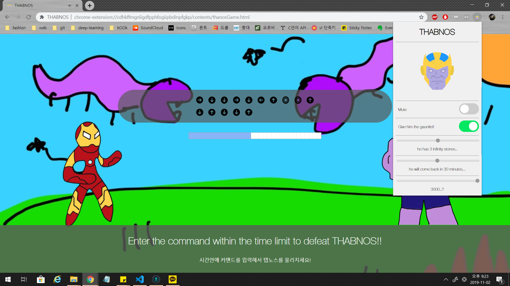

# THABNOS
무분별하게 컴퓨터 리소스를 낭비하는 전산학부 학생들에게 분노한 타노스가 탭을 날려버리려 합니다. 당신은 아이언맨이 되어 잔악무도한 타노스를 물리치고 탭을 지켜내야 합니다. 타노스를 물리치지 못할 경우 탭의 절반이 사라지게 됩니다.

배경음악은 세계 최고의 아티스트들과 협업하여 만들어졌고, 현대미술의 거장 로모토스키 한이 일러스트에 참여했습니다.
설정을 통해 타노스가 가지고 있는 인피니티 스톤의 개수와 한번 클리어 했을 때 쉬었다 오는 시간을 지정할 수 있습니다.

THABNOS는 크롬 익스텐션으로 개발되었고, 현재 크롬 웹 스토어 심사 과정에 있습니다. 다음 github 링크를 통해서도 다운로드 받을 수 있습니다.

그럼 고생 좀 해보시기 바랍니다.

https://www.github.com/sklationd/TVI

